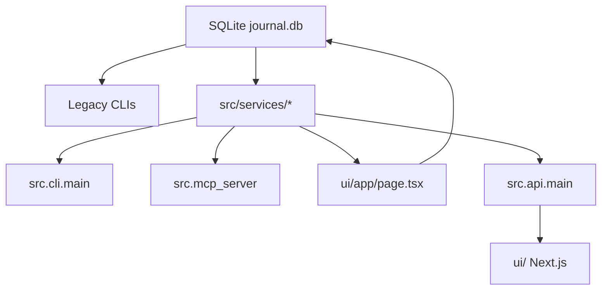

# Trading Journal Refactor Status Handoff

Date: 2026-05-09

## Current Status

Phase 8 (FastAPI + Next.js) is feature-complete for read-only parity. The
service-layer refactor landed at `8b1bbfd`; the latest Phase 8 commit is
`047ed93`. A read-only FastAPI backend and a polished Next.js dashboard exist
side-by-side with the existing Next.js dashboard. Streamlit remains the
active UI until write workflows (Broker MCP, Settings) are decided.

The interactive CLI (`python -m src.journal_cli`) now has a working "Launch
Next.js dashboard" option (menu item 7) that starts both the API and UI,
waits for them to become ready, and auto-opens the browser.

Key recent commits (newest first):

- `047ed93` Auto-open browser when Next.js dashboard launches
- `160c1a4` Rewrite Next.js launcher to kill stale processes and verify startup
- `c51e5e9` Use cmd /c start /b for Next.js dashboard launcher on Windows
- `12c15d0` Fix Next.js dashboard launcher with port conflict detection
- `deafb27` Use node directly instead of npx to launch Next.js dev server
- `aad9a0d` Add Launch Next.js dashboard to interactive CLI housekeeping menu
- `89d4513` Update handoff doc with formatting polish and smoke test
- `ee204c4` Back yearly and account dashboard sections with API data
- `8f9608c` Add FastAPI backend and Next dashboard scaffold
- `8b1bbfd` Refactor journal services and dashboard calculations

Full regression at this checkpoint:

```bash
rtk pytest -q
# 510 passed
```

Latest Phase 8 focused backend checkpoint:

```bash
rtk pytest tests/unit/test_api_main.py tests/unit/test_cli_main.py -q
# 22 passed
```

## Completed Phases

### Phase 1 — Portfolio Service Layer

Added shared portfolio/query services for CLI, MCP, and dashboard-adjacent use:

- `src/services/portfolio.py`
- `tests/unit/test_portfolio_service.py`

MCP read tools now call the shared portfolio service instead of owning separate
query logic.

### Phase 2 — Unified Non-Interactive CLI

Added additive CLI surface:

```bash
python -m src.cli.main portfolio summary
python -m src.cli.main portfolio positions
python -m src.cli.main portfolio performance
python -m src.cli.main transactions
python -m src.cli.main ingest csv
python -m src.cli.main ingest snapshot
python -m src.cli.main account cash get
python -m src.cli.main account cash set
python -m src.cli.main account margin get
python -m src.cli.main account margin set
python -m src.cli.main health
python -m src.cli.main dashboard next
python -m src.cli.main dashboard capabilities
```

The interactive CLI (`python -m src.journal_cli`) housekeeping menu includes:

- Option 6: Launch Next.js dashboard (auto-opens browser)
- Option 7: Launch Next.js dashboard (kills stale processes, waits for
  API + UI readiness, auto-opens browser)
- Option 8: Stop dashboard (kills API and Next.js processes)

Legacy CLIs were intentionally preserved:

- `python -m src.journal_cli`
- `python -m src.ingest`
- `python -m src.cash`
- `python -m src.margin`
- `python -m src.mcp_ingest`
- Broker CLIs under `src/cli/*`

### Phase 3 — MCP Structured Receipts

MCP tools now return structured JSON-style envelopes with:

- `status`
- `operation`
- `generated_at`
- `warnings`
- `errors`
- `data`

Covered key read/write operations including portfolio summaries, positions,
performance, ingest, margin, refresh, and dashboard launch.

### Phase 4 — DB Hardening

Added schema migration tracking and sync-run audit helpers:

- `schema_migrations`
- `sync_runs`
- optional `sync_run_id` on core position/snapshot/balance tables

Existing callers remain compatible because `sync_run_id` is optional.

### Phase 5 — Canonical Current Position Read Model

Added `src/services/position_read_model.py` to normalize current positions
across:

- equities
- options
- futures
- crypto
- margin sentinel rows

This gives CLI, MCP, dashboard, and future UI code a stable current-position
contract without immediately collapsing the underlying DB tables.

### Phase 6 — Dashboard Calculation Extraction

Added the dashboard capability parity contract:

- `src/services/dashboard_capabilities.py`
- `docs/dashboard-capability-parity.md`

Extracted calculation-heavy tabs into services:

- `src/services/dashboard_portfolio.py`
- `src/services/dashboard_transactions.py`
- `src/services/dashboard_positions.py`
- `src/services/dashboard_performance.py`

The active Next.js dashboard still exposes the same eight top-level tabs:

1. Portfolio
2. Yearly Summary
3. By Account
4. Positions
5. Transactions
6. Performance
7. Broker MCP
8. Settings

The Positions tab still has the same four sub-tabs:

- Equity
- Options
- Futures
- Crypto

### Phase 8 - FastAPI + React/Next.js Migration In Progress

Read-only FastAPI backend foundation added:

- `src/api/__init__.py`
- `src/api/main.py`
- `tests/unit/test_api_main.py`

Dependencies added to `requirements.txt`:

- `fastapi`
- `uvicorn`
- `httpx`

API endpoints currently available:

```bash
GET /
GET /health
GET /dashboard/capabilities
GET /dashboard/portfolio
GET /dashboard/performance
GET /dashboard/yearly-summary
GET /dashboard/by-account
GET /portfolio/summary
GET /portfolio/yearly-summary
GET /portfolio/account-summary
GET /portfolio/positions
GET /portfolio/performance
GET /transactions
```

Unified CLI now has API and dashboard launchers:

```bash
python -m src.cli.main api launch --host 127.0.0.1 --port 8000 --reload
python -m src.cli.main dashboard next --reload
python -m src.cli.main dashboard next --api-port 8000 --ui-port 3000 --reload
```

The API is intentionally read-only at this checkpoint. Mutating workflows
remain in existing CLI/MCP paths until the new UI has read-only parity.

Next.js UI scaffold added under `ui/`:

- `ui/app/layout.tsx`
- `ui/app/page.tsx`
- `ui/app/styles.css`
- `ui/package.json`
- `ui/package-lock.json`
- `ui/next.config.mjs`
- `ui/tsconfig.json`

The UI currently renders the same eight top-level tabs from the dashboard
capability contract:

1. Portfolio
2. Yearly Summary
3. By Account
4. Positions
5. Transactions
6. Performance
7. Broker MCP
8. Settings

Current API-backed UI coverage:

- Portfolio dashboard sections: net worth banner, transaction KPIs, account
  summary, asset-class breakdown, futures by commodity, sector allocation,
  positions by account, and sector summary
- Yearly Summary dashboard sections: year-over-year summary and income
  breakdown by type
- By Account dashboard sections: net cash flow, dividends/rewards,
  margin/fees, and Coinbase crypto flow
- Positions table from canonical current positions with Equity, Options,
  Futures, and Crypto sub-tabs
- Recent Transactions table
- Performance dashboard sections: portfolio summary and portfolio returns
- Capability rows for Broker MCP and Settings

The UI dependency line is pinned to conservative, verified versions after
Next 16/React 19 showed unreliable hydration in Chrome during local smoke
testing:

- `next@15.5.18`
- `react@18.3.1`
- `react-dom@18.3.1`

UI formatting polish applied:

- Currency formatting with `$1,234.56` for all money columns
- Percentage columns with `+/-` signs
- Red/green coloring for negative/positive values
- Column header mapping from API field names to human-readable labels
- Transaction KPIs rendered as styled metric cards
- Sticky table headers with row hover highlights
- Scrollable capped tables for large datasets (Positions by Account)
- Segmented control fixed (missing `--ink` CSS variable)

Smoke test script added: `tests/smoke_ui.py` (15 checks, all passing)

Browser smoke on `http://127.0.0.1:3000/` verified:

- API fetches to `http://127.0.0.1:8000`
- capability count updates to 37
- Portfolio renders non-zero metrics
- Portfolio renders 13 account-summary rows, 6 asset-class rows, 10 futures
  commodity rows, 14 sector rows, and 148 equity position rows
- Yearly Summary renders 9 summary rows and 16 income breakdown rows
- By Account renders three 9-row pivot tables plus crypto flow inflow/outflow
  tables
- Positions tab renders 181 rows and four asset-class sub-tabs:
  148 equity, 8 options, 11 futures, 14 crypto
- Transactions tab renders 25 recent rows
- Performance tab renders separate summary and returns tables
- no console errors after the version pin

Frontend verification also passed:

```bash
npm audit --json
# 0 vulnerabilities
npm run typecheck
npm run build
# Next.js 15.5.18 production build succeeded
```

## Intentional Non-Extraction

Broker MCP and Settings remain in `ui/app/page.tsx` for now.

Rationale:

- Broker MCP is mostly UI-triggered buttons plus a static CLI review table.
- Settings is form state plus DB writes and immediate adjustment-row mutation.
- Extracting either now would add abstraction before there is enough reusable
  business logic to justify it.

If these tabs grow richer, extract only the reusable parts:

- Broker MCP: health receipt normalization and broker live-check adapters.
- Settings: validation and save/apply workflows, with tests around DB writes.

## Dashboard Parity Guardrail

Use this before replacing or materially changing the dashboard:

```bash
python -m src.cli.main dashboard capabilities
pytest tests/unit/test_dashboard_capabilities.py tests/unit/test_cli_main.py -q
```

The dashboard replacement must cover every required `capability_id` returned by
the CLI command.

## Current Architecture Shape



Important note: some legacy CLI and dashboard code still reads DB helpers
directly. The refactor is additive and incremental; direct DB reads are being
reduced where there is clear reuse value.

## Repo Structure Audit (2026-05-09)

### Redundant CLI Entry Points

Three CLI interfaces exist with overlapping functionality:

| Module | Size | Status |
|--------|------|--------|
| `src/cli/main.py` | 428 lines | **Canonical** — unified non-interactive CLI |
| `src/journal_cli.py` | 33.7K lines | **Legacy** — interactive terminal browser, not imported anywhere |
| `src/cash.py` | 1.2K lines | **Superseded** — duplicated by `cli/main.py account cash get/set` |
| `src/margin.py` | 2.6K lines | **Superseded** — duplicated by `cli/main.py account margin get/set` |

`cash.py` and `margin.py` are fully superseded by the unified CLI and can be
deprecated with a print redirect. `journal_cli.py` is intentionally preserved
as the interactive terminal UI — decide its fate when the Next.js UI is
feature-complete.

### Clean Findings (no action needed)

- All `__init__.py` files present across all packages
- All core modules imported and used — no dead code in service/API layers
- `ui/node_modules/` and `ui/.next/` already in `.gitignore`
- Test structure is clean: `tests/unit/`, `tests/integration/`, `tests/smoke_ui.py`
- No duplicate business logic detected between services, API, and CLI
- Consistent naming conventions across parsers, fetchers, and services

## Remaining TODO

1. Decide the replacement shape for Broker MCP and Settings. Keep mutation
   flows in CLI/MCP until explicit write workflows are designed and tested.
2. ~~Add frontend tests or a lightweight browser smoke script~~ — done:
   `tests/smoke_ui.py` (15 checks covering all API endpoints and UI rendering).
3. Keep Next.js as the primary UI and continue closing remaining parity gaps.
4. ~~Review line-ending-only local noise~~ — confirmed clean, no accidental changes.
5. Add column sorting to Next.js DataTable component. Streamlit tables support
   click-to-sort on any column header; the Next.js tables are currently static.
6. Add transaction filters (category, broker, year multiselect + search box)
   and CSV export button. Next.js currently shows only 25 recent rows.
7. Add positions broker filter (Streamlit has a multiselect across all
   position sub-tabs).
8. Add sector allocation pie chart (Streamlit renders Plotly pie; Next.js
   shows only the table).
9. Add position sub-tab KPI cards (Market Value, Cost, P&L, Return %,
   Dividends for equity; Contracts + MV for options/futures).
10. Add collapsible sections for options/futures grouped by account
    (Streamlit uses expanders; Next.js shows flat tables).
11. Add bold styling on TOTAL rows in tables.
12. Add global sidebar controls (date range, account filter, refresh,
    internal transfers toggle).

Data accuracy verified 2026-05-09: API values match service layer exactly
across all endpoints (net worth, market value, margin, position counts,
yearly summary, performance returns). No calculation divergence.

## Verification Commands Used

```bash
rtk python -m py_compile ui/app/page.tsx src/services/*.py
rtk python -m py_compile src/api/main.py src/api/__init__.py
rtk python -m src.cli.main dashboard capabilities
rtk python -m src.cli.main dashboard next --help
rtk python -m src.cli.main api launch --host 127.0.0.1 --port 8000 --reload
rtk pytest tests/unit/test_api_main.py tests/unit/test_cli_main.py -q
rtk pytest -q
python tests/smoke_ui.py
cd ui
npm audit --json
npm run typecheck
npm run build
```
