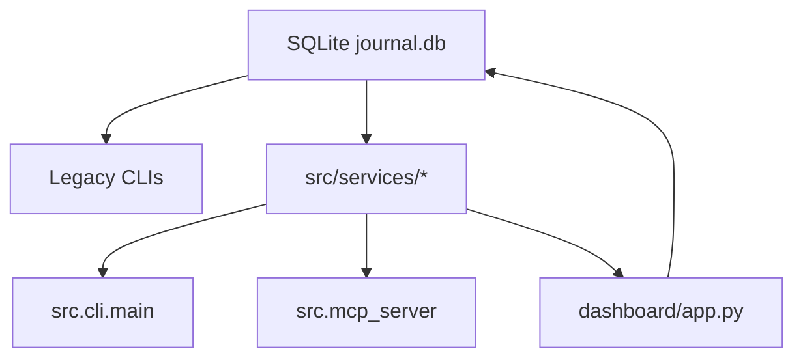

# Trading Journal Refactor Status Handoff

Date: 2026-05-08

## Current Status

The refactor has reached a stable service-layer checkpoint. Calculation-heavy
logic has been moved out of `dashboard/app.py` into tested service modules while
the existing Streamlit dashboard remains the active UI.

Full regression at this checkpoint:

```bash
pytest -q
# 496 passed
```

## Completed Phases

### Phase 1 — Portfolio Service Layer

Added shared portfolio/query services for CLI, MCP, and dashboard-adjacent use:

- `src/services/portfolio.py`
- `tests/unit/test_portfolio_service.py`

MCP read tools now call the shared portfolio service instead of owning separate
query logic.

### Phase 2 — Unified Non-Interactive CLI

Added additive CLI surface:

```bash
python -m src.cli.main portfolio summary
python -m src.cli.main portfolio positions
python -m src.cli.main portfolio performance
python -m src.cli.main transactions
python -m src.cli.main ingest csv
python -m src.cli.main ingest snapshot
python -m src.cli.main account cash get
python -m src.cli.main account cash set
python -m src.cli.main account margin get
python -m src.cli.main account margin set
python -m src.cli.main health
python -m src.cli.main dashboard launch
python -m src.cli.main dashboard capabilities
```

Legacy CLIs were intentionally preserved:

- `python -m src.journal_cli`
- `python -m src.ingest`
- `python -m src.cash`
- `python -m src.margin`
- `python -m src.mcp_ingest`
- Broker CLIs under `src/cli/*`

### Phase 3 — MCP Structured Receipts

MCP tools now return structured JSON-style envelopes with:

- `status`
- `operation`
- `generated_at`
- `warnings`
- `errors`
- `data`

Covered key read/write operations including portfolio summaries, positions,
performance, ingest, margin, refresh, and dashboard launch.

### Phase 4 — DB Hardening

Added schema migration tracking and sync-run audit helpers:

- `schema_migrations`
- `sync_runs`
- optional `sync_run_id` on core position/snapshot/balance tables

Existing callers remain compatible because `sync_run_id` is optional.

### Phase 5 — Canonical Current Position Read Model

Added `src/services/position_read_model.py` to normalize current positions
across:

- equities
- options
- futures
- crypto
- margin sentinel rows

This gives CLI, MCP, dashboard, and future UI code a stable current-position
contract without immediately collapsing the underlying DB tables.

### Phase 6 — Dashboard Calculation Extraction

Added the dashboard capability parity contract:

- `src/services/dashboard_capabilities.py`
- `docs/dashboard-capability-parity.md`

Extracted calculation-heavy tabs into services:

- `src/services/dashboard_portfolio.py`
- `src/services/dashboard_transactions.py`
- `src/services/dashboard_positions.py`
- `src/services/dashboard_performance.py`

The active Streamlit dashboard still exposes the same eight top-level tabs:

1. Portfolio
2. Yearly Summary
3. By Account
4. Positions
5. Transactions
6. Performance
7. Broker MCP
8. Settings

The Positions tab still has the same four sub-tabs:

- Equity
- Options
- Futures
- Crypto

## Intentional Non-Extraction

Broker MCP and Settings remain in `dashboard/app.py` for now.

Rationale:

- Broker MCP is mostly UI-triggered buttons plus a static CLI review table.
- Settings is form state plus DB writes and immediate adjustment-row mutation.
- Extracting either now would add abstraction before there is enough reusable
  business logic to justify it.

If these tabs grow richer, extract only the reusable parts:

- Broker MCP: health receipt normalization and broker live-check adapters.
- Settings: validation and save/apply workflows, with tests around DB writes.

## Dashboard Parity Guardrail

Use this before replacing or materially changing the dashboard:

```bash
python -m src.cli.main dashboard capabilities
pytest tests/unit/test_dashboard_capabilities.py tests/unit/test_cli_main.py -q
```

The dashboard replacement must cover every required `capability_id` returned by
the CLI command.

## Current Architecture Shape



Important note: some legacy CLI and dashboard code still reads DB helpers
directly. The refactor is additive and incremental; direct DB reads are being
reduced where there is clear reuse value.

## Remaining TODO

1. Decide whether to commit this checkpoint before deeper refactoring.
2. Consider extracting dashboard rendering into smaller Streamlit functions only
   after the service-layer checkpoint is committed.
3. Consider adding CLI commands for dashboard service reports if they are useful
   outside the UI.
4. Keep Broker MCP and Settings in Streamlit until a stronger reuse case appears.
5. Review pre-existing dirty files before staging; do not blindly stage unrelated
   local edits.

## Verification Commands Used

```bash
python -m py_compile dashboard/app.py src/services/*.py
python -m src.cli.main dashboard capabilities
pytest -q
```
