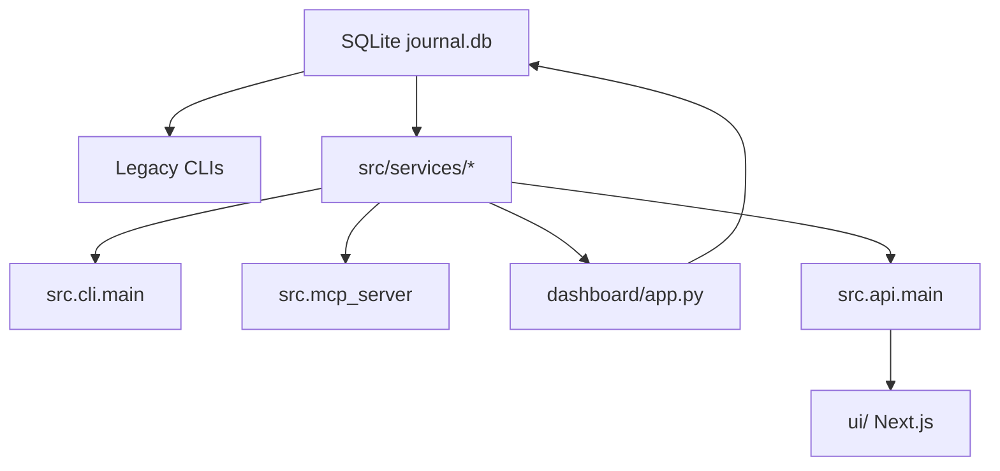

# Trading Journal Refactor Status Handoff

Date: 2026-05-08

## Current Status

The service-layer refactor has been pushed to `master` at commit `8b1bbfd`.
Phase 8 is in progress: a read-only FastAPI backend and a Next.js dashboard
scaffold now exist side-by-side with the existing Streamlit dashboard. Streamlit
remains the active UI until the new UI reaches verified capability parity.

Full regression at this checkpoint:

```bash
rtk pytest -q
# 507 passed
```

Latest Phase 8 focused backend checkpoint:

```bash
rtk pytest tests/unit/test_api_main.py tests/unit/test_cli_main.py -q
# 19 passed
```

## Completed Phases

### Phase 1 — Portfolio Service Layer

Added shared portfolio/query services for CLI, MCP, and dashboard-adjacent use:

- `src/services/portfolio.py`
- `tests/unit/test_portfolio_service.py`

MCP read tools now call the shared portfolio service instead of owning separate
query logic.

### Phase 2 — Unified Non-Interactive CLI

Added additive CLI surface:

```bash
python -m src.cli.main portfolio summary
python -m src.cli.main portfolio positions
python -m src.cli.main portfolio performance
python -m src.cli.main transactions
python -m src.cli.main ingest csv
python -m src.cli.main ingest snapshot
python -m src.cli.main account cash get
python -m src.cli.main account cash set
python -m src.cli.main account margin get
python -m src.cli.main account margin set
python -m src.cli.main health
python -m src.cli.main dashboard launch
python -m src.cli.main dashboard capabilities
```

Legacy CLIs were intentionally preserved:

- `python -m src.journal_cli`
- `python -m src.ingest`
- `python -m src.cash`
- `python -m src.margin`
- `python -m src.mcp_ingest`
- Broker CLIs under `src/cli/*`

### Phase 3 — MCP Structured Receipts

MCP tools now return structured JSON-style envelopes with:

- `status`
- `operation`
- `generated_at`
- `warnings`
- `errors`
- `data`

Covered key read/write operations including portfolio summaries, positions,
performance, ingest, margin, refresh, and dashboard launch.

### Phase 4 — DB Hardening

Added schema migration tracking and sync-run audit helpers:

- `schema_migrations`
- `sync_runs`
- optional `sync_run_id` on core position/snapshot/balance tables

Existing callers remain compatible because `sync_run_id` is optional.

### Phase 5 — Canonical Current Position Read Model

Added `src/services/position_read_model.py` to normalize current positions
across:

- equities
- options
- futures
- crypto
- margin sentinel rows

This gives CLI, MCP, dashboard, and future UI code a stable current-position
contract without immediately collapsing the underlying DB tables.

### Phase 6 — Dashboard Calculation Extraction

Added the dashboard capability parity contract:

- `src/services/dashboard_capabilities.py`
- `docs/dashboard-capability-parity.md`

Extracted calculation-heavy tabs into services:

- `src/services/dashboard_portfolio.py`
- `src/services/dashboard_transactions.py`
- `src/services/dashboard_positions.py`
- `src/services/dashboard_performance.py`

The active Streamlit dashboard still exposes the same eight top-level tabs:

1. Portfolio
2. Yearly Summary
3. By Account
4. Positions
5. Transactions
6. Performance
7. Broker MCP
8. Settings

The Positions tab still has the same four sub-tabs:

- Equity
- Options
- Futures
- Crypto

### Phase 8 - FastAPI + React/Next.js Migration In Progress

Read-only FastAPI backend foundation added:

- `src/api/__init__.py`
- `src/api/main.py`
- `tests/unit/test_api_main.py`

Dependencies added to `requirements.txt`:

- `fastapi`
- `uvicorn`
- `httpx`

API endpoints currently available:

```bash
GET /
GET /health
GET /dashboard/capabilities
GET /dashboard/portfolio
GET /dashboard/performance
GET /portfolio/summary
GET /portfolio/yearly-summary
GET /portfolio/account-summary
GET /portfolio/positions
GET /portfolio/performance
GET /transactions
```

Unified CLI now has an API launcher:

```bash
python -m src.cli.main api launch --host 127.0.0.1 --port 8000 --reload
```

The API is intentionally read-only at this checkpoint. Mutating workflows
remain in existing CLI/MCP paths until the new UI has read-only parity.

Next.js UI scaffold added under `ui/`:

- `ui/app/layout.tsx`
- `ui/app/page.tsx`
- `ui/app/styles.css`
- `ui/package.json`
- `ui/package-lock.json`
- `ui/next.config.mjs`
- `ui/tsconfig.json`

The UI currently renders the same eight top-level tabs from the dashboard
capability contract:

1. Portfolio
2. Yearly Summary
3. By Account
4. Positions
5. Transactions
6. Performance
7. Broker MCP
8. Settings

Current API-backed UI coverage:

- Portfolio dashboard sections: net worth banner, transaction KPIs, account
  summary, asset-class breakdown, futures by commodity, sector allocation,
  positions by account, and sector summary
- Yearly Summary metrics by year plus total
- By Account metrics by account plus total
- Positions table from canonical current positions with Equity, Options,
  Futures, and Crypto sub-tabs
- Recent Transactions table
- Performance dashboard sections: portfolio summary and portfolio returns
- Capability rows for Broker MCP and Settings

The UI dependency line is pinned to conservative, verified versions after
Next 16/React 19 showed unreliable hydration in Chrome during local smoke
testing:

- `next@15.5.18`
- `react@18.3.1`
- `react-dom@18.3.1`

Browser smoke on `http://127.0.0.1:3000/` verified:

- API fetches to `http://127.0.0.1:8000`
- capability count updates to 37
- Portfolio renders non-zero metrics
- Portfolio renders 13 account-summary rows, 6 asset-class rows, 10 futures
  commodity rows, 14 sector rows, and 148 equity position rows
- Yearly Summary renders 8 API-backed rows
- By Account renders 9 API-backed rows
- Positions tab renders 181 rows and four asset-class sub-tabs:
  148 equity, 8 options, 11 futures, 14 crypto
- Transactions tab renders 25 recent rows
- Performance tab renders separate summary and returns tables
- no console errors after the version pin

Frontend verification also passed:

```bash
npm audit --json
# 0 vulnerabilities
npm run typecheck
npm run build
# Next.js 15.5.18 production build succeeded
```

## Intentional Non-Extraction

Broker MCP and Settings remain in `dashboard/app.py` for now.

Rationale:

- Broker MCP is mostly UI-triggered buttons plus a static CLI review table.
- Settings is form state plus DB writes and immediate adjustment-row mutation.
- Extracting either now would add abstraction before there is enough reusable
  business logic to justify it.

If these tabs grow richer, extract only the reusable parts:

- Broker MCP: health receipt normalization and broker live-check adapters.
- Settings: validation and save/apply workflows, with tests around DB writes.

## Dashboard Parity Guardrail

Use this before replacing or materially changing the dashboard:

```bash
python -m src.cli.main dashboard capabilities
pytest tests/unit/test_dashboard_capabilities.py tests/unit/test_cli_main.py -q
```

The dashboard replacement must cover every required `capability_id` returned by
the CLI command.

## Current Architecture Shape



Important note: some legacy CLI and dashboard code still reads DB helpers
directly. The refactor is additive and incremental; direct DB reads are being
reduced where there is clear reuse value.

## Remaining TODO

1. Decide the replacement shape for Broker MCP and Settings. Keep mutation
   flows in CLI/MCP until explicit write workflows are designed and tested.
2. Add frontend tests or a lightweight browser smoke script for tab switching
   and API-backed rendering.
3. Keep Streamlit active until the new UI reaches verified capability parity.
4. Review line-ending-only local noise before staging any future commits.

## Verification Commands Used

```bash
rtk python -m py_compile dashboard/app.py src/services/*.py
rtk python -m py_compile src/api/main.py src/api/__init__.py
rtk python -m src.cli.main dashboard capabilities
rtk python -m src.cli.main api launch --host 127.0.0.1 --port 8000 --reload
rtk pytest tests/unit/test_api_main.py tests/unit/test_cli_main.py -q
rtk pytest -q
cd ui
npm audit --json
npm run typecheck
npm run build
```
